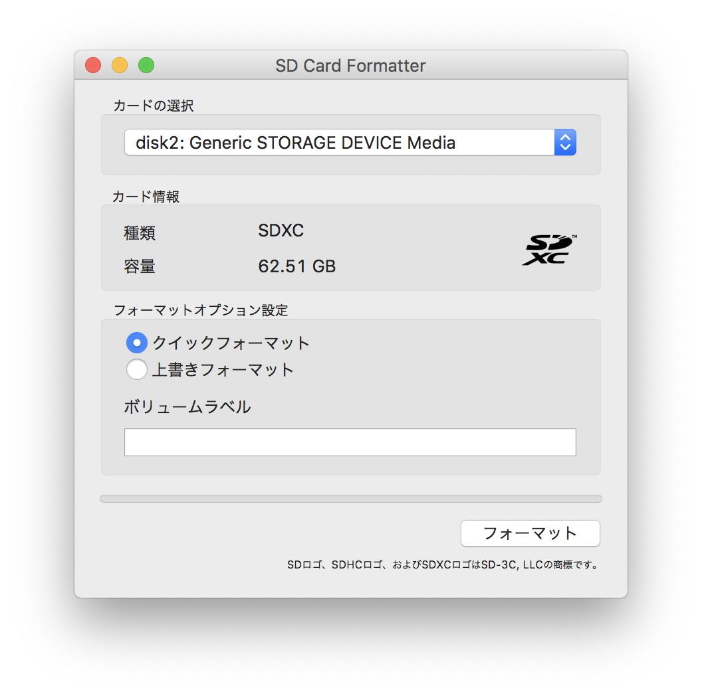
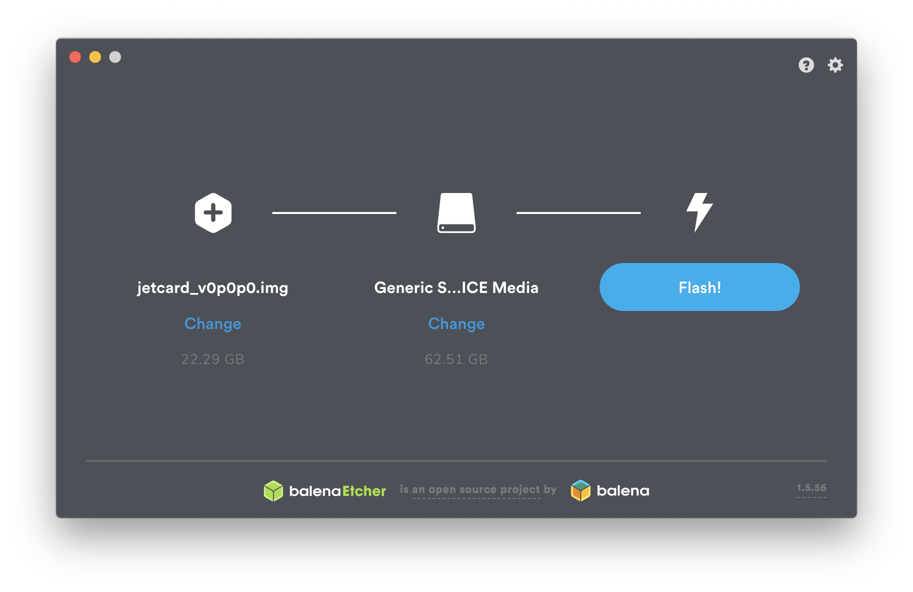

# Jetson Nano のセットアップ

## Jetcard のダウンロード
Jetcard は、ヘッドレスでJetson Nanoをセットアップすることができるイメージ。
https://github.com/NVIDIA-AI-IOT/jetcard から SD card イメージをダウンロードする。

## Jetcard をSDカードに書き込む
- SD Card Formatter

- Etcher で jetcard-v0p0p0.img をSDに書き込む (数分かかる)


## Jetson 本体のキッティング
- [x] SDを入れる
- [x] J48をジャンパーピンでショートして、ACアダプタ給電に切り替える

## 電源を入れる
初回のブート時には、SDイメージからOSが展開されてセットアップされるまでX分ほど時間がかかる。HDMIディスプレイを接続しておけば進捗状況を確認できる。

## USB接続でSSHログインする
USBで接続すると、Macに Linux for Tegra というIFが作成される。
JetPackにはデフォルトでmDNSがセットアップされているので、```jetson.local```という名前でSSHログインができます。
```
$ ssh jetson@jetson.local
jetson@jetson.local's password:
Welcome to Ubuntu 18.04.2 LTS (GNU/Linux 4.9.140-tegra aarch64)

 * Documentation:  https://help.ubuntu.com
 * Management:     https://landscape.canonical.com
 * Support:        https://ubuntu.com/advantage

This system has been minimized by removing packages and content that are
not required on a system that users do not log into.

To restore this content, you can run the 'unminimize' command.

400 packages can be updated.
189 updates are security updates.

Last login: Thu Jun 20 18:52:17 2019 from 192.168.55.100
```

jetson ユーザーのパスワードは jetson

## Ethernet経由でSSHログインする
```
$ ssh jetson@jetson.local
jetson@jetson.local's password:
Welcome to Ubuntu 18.04.2 LTS (GNU/Linux 4.9.140-tegra aarch64)

 * Documentation:  https://help.ubuntu.com
 * Management:     https://landscape.canonical.com
 * Support:        https://ubuntu.com/advantage

This system has been minimized by removing packages and content that are
not required on a system that users do not log into.

To restore this content, you can run the 'unminimize' command.

534 packages can be updated.
275 updates are security updates.

Last login: Thu Oct  3 19:58:24 2019 from fe80::180d:b496:a170:f20f%l4tbr0
```

EthernetだとIPv6になっている様子。

## OSのパッケージを更新する
```
$ sudo apt-get update
$ sudo apt-get upgrade
```
root のパスワードも jetson

## ホスト名が衝突しないように変更する
ハンズオン形式だと同一ネットワークに同じ名前のホストが発生するとmDNSが混乱するので、ホスト名をSDカードごとに変更しておく。

```/etc/hostname``` と ```/etc/hosts``` を修正する。

リブート後に mDNS で新しいホスト名でSSH接続ができることを確認する。

## 動作モードの変更
Jetson Nano のデフォルトの動作モードは、5Wモードで動作しているので、性能を引き出すために10Wモードに変更する。

```
$ sudo nvpmodel -m 0
$ sudo jetson_clocks
```

## リモートでXに接続する
```
$ sudo apt-get install xrdp xtightvncviewer x11vnc xfce4
```

VNC接続にパスワードを設定する。

```
$ x11vnc -storepasswd
```

システム起動時にVNCが自動的に起動するように設定する。

```
$ cd ~/.config
$ mkdir autostart
$ cd autostart
$ vi x11vnc.desktop
```

```~/.config/autostart/x11vnc.desktop```
```
[Desktop Entry]
Encoding=UTF-8
Type=Application
Name=X11VNC
Comment=
Exec=x11vnc -forever -usepw -display :0
StartupNotify=false
Terminal=false
Hidden=false
```

```
$ echo xfce4-session > ~/.xsession
```

```
$ sudo vim /etc/xrdp/startwm.sh
```

```/etc/xrdp/startwm.sh``` の最後の行をコメントアウトして、代わりに startxfce4 を起動する。
```
# exec /bin/sh /etc/X11/Xsession
startxfce4
```

リブート後 RDP クライアントから接続する。
