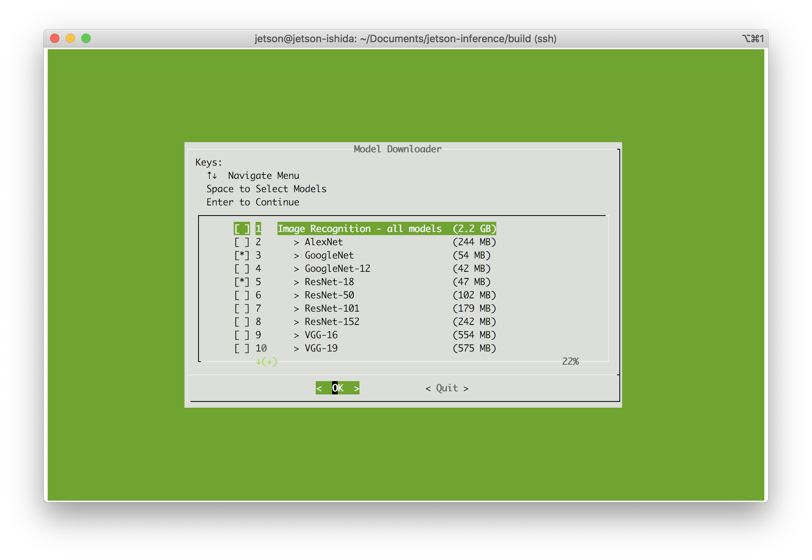
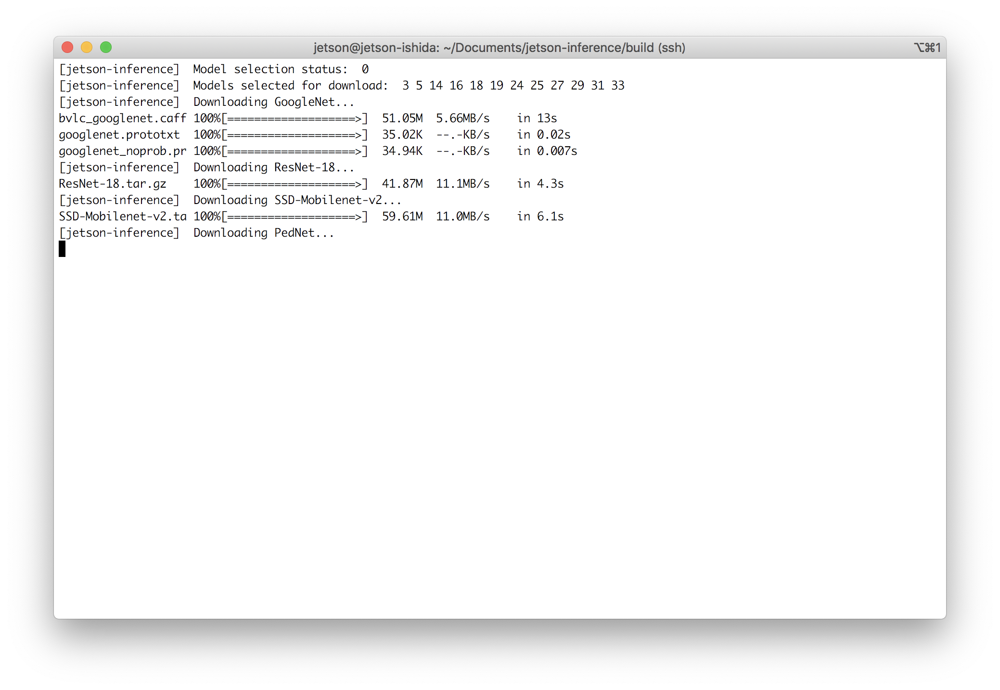
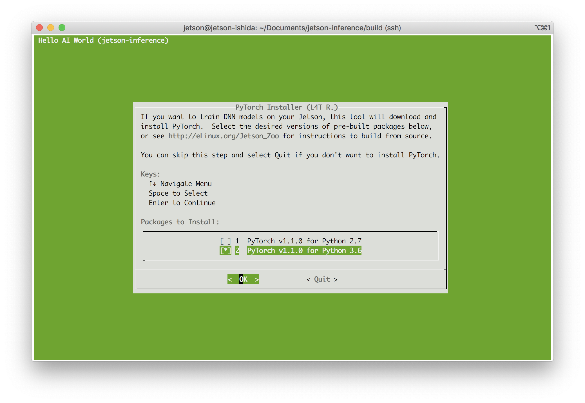
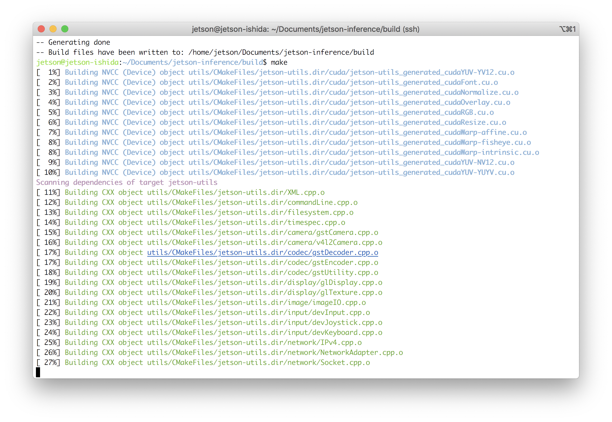
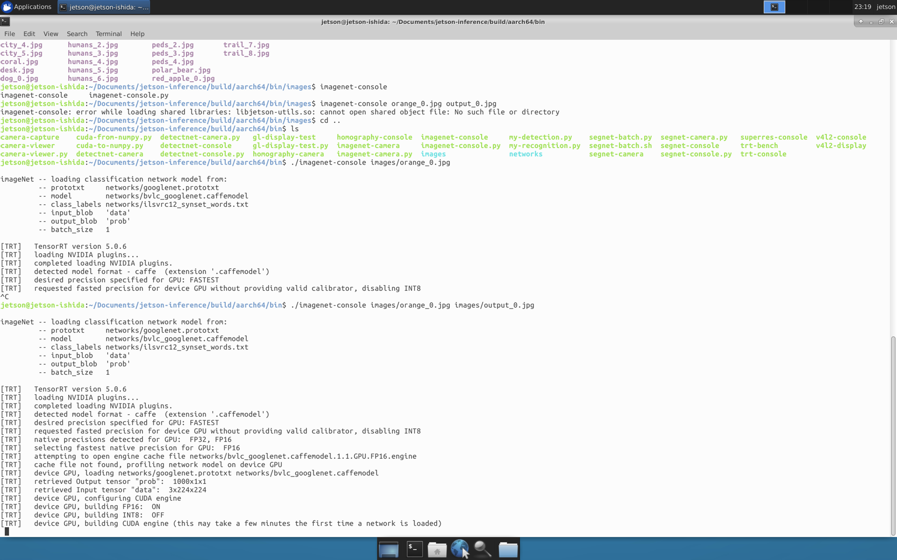
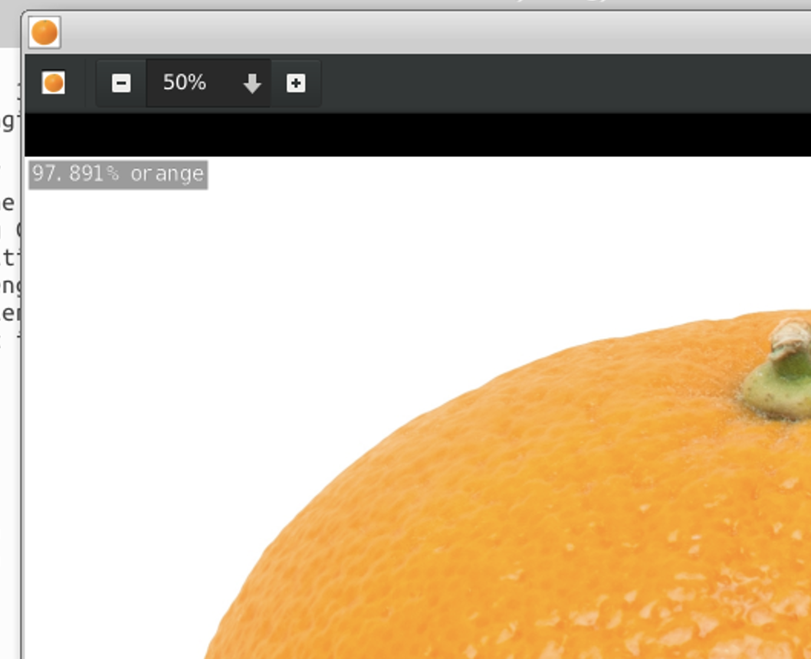

# jetson-inference を試す

## インストールとビルド
```
$ git clone https://github.com/dusty-nv/jetson-inference
$ cd jetson-inference/
$ git submodule update --init
$ mkdir build
$ cd build
$ cmake ..
```

インストール時にダウンロードする学習済みモデルの選択画面が開くので、ResNet50を追加してダウンロードする。



ダウンロード中



PyTorch の選択


```
$ make
```

ビルド中


```
$ sudo make install
```

## デモプログラムを試してみる

RDPで繋いだデスクトップ環境で実行する。

```
$ cd ~/jetson-inference/build/aarch64/bin
$ eog images/orange_0.jpg
```

```
$ imagenet-console images/orange_0.jpg images/output_0.jpg
```



結果を確認
```
$ eog images/output_0.jpg
```



97.891% でオレンジ

detectnet -> https://github.com/dusty-nv/jetson-inference/blob/master/docs/detectnet-console-2.md
